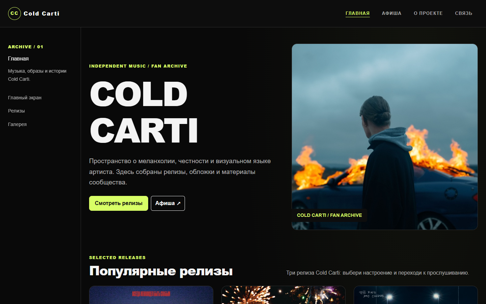
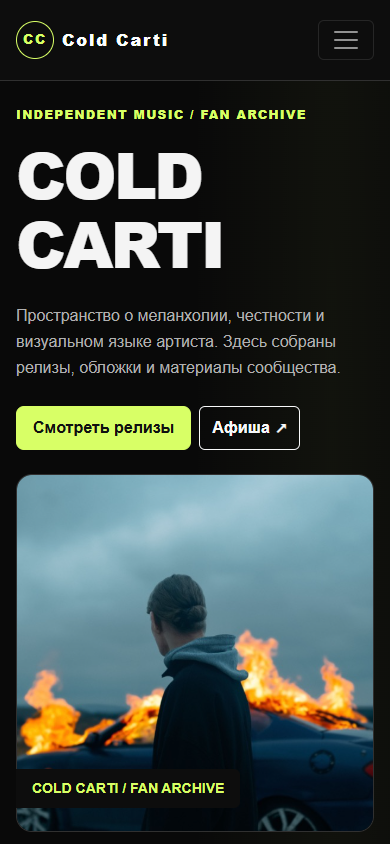

# Music Band — Cold Carti Fan Archive

Учебный многостраничный фан-архив Cold Carti: релизы, обложки, концертная афиша и общение слушателей. Сайт продолжает тему Music Band из предыдущих заданий.

**Сайт:** https://kanatovs.github.io/music-bandv3/  
**Репозиторий:** https://github.com/kanatovs/music-bandv3  
**Группа:** SE-2501

## Команда и страницы

| Участник | Основные страницы | Ответственность |
| --- | --- | --- |
| Kanatov Sabyrzhan | `index.html`, `contact.html` | Главная, Bootstrap grid, карточки релизов, карусель, фильтр галереи, форма и её проверка |
| Zhaxylyk Alikhan | `tour.html`, `about.html` | Афиша, адаптивные карточки, визуальная концепция, информация о проекте и команде |

У каждого участника две основные HTML-страницы. Дополнительная `media-queries.html` — совместная подборка релизов, сохранённая из задания №3; её сетка работает на собственном CSS без Bootstrap. Имена участников и группа указаны в footer каждой страницы, ответственность — в комментарии в head основных страниц.

## Возможности

- Главная: три популярных релиза, ручная карусель из девяти обложек и галерея с фильтром по году.
- Афиша: три демонстрационные концертные карточки и ссылки на музыку и сообщество.
- О проекте: концепция архива и участники команды.
- Связь: форма с именем, email, выбором релиза, радиокнопками, сообщением и checkbox.
- Подборка релизов: отдельная страница с CSS Grid, Flexbox и media queries.

Форма проверяет обязательные поля, формат email и сообщения из одних пробелов. Результат выводится на странице. Это клиентская демонстрация: сообщения и подписки не отправляются и не сохраняются. При выключенном JavaScript кнопка проверки недоступна. Концертные даты и статусы — примеры, продажи билетов нет. Архив не является официальным сайтом артиста.

## Технологии и структура

Используются HTML5, CSS3, JavaScript и Bootstrap 5.3.8. Сборка, npm-пакеты и серверная часть не требуются. Bootstrap и все изображения находятся внутри проекта, поэтому интерфейс не зависит от CDN. Для прослушивания релизов нужен интернет.

```text
music-bandv3/
├── index.html                 # Главная, релизы, карусель и галерея
├── tour.html                  # Демонстрационная афиша
├── about.html                 # Концепция и команда
├── contact.html               # Форма сообщества
├── media-queries.html         # Подборка без Bootstrap
├── style.css                  # Общая тема четырёх основных страниц
├── media-queries.css          # Самостоятельная адаптивная CSS-сетка
├── site.js                    # Проверка формы и фильтр галереи
├── assets/
│   ├── favicon.svg
│   ├── covers/                # Девять локальных обложек и sources.json
│   └── vendor/bootstrap/      # Локальные CSS и JS Bootstrap
├── .nojekyll                  # GitHub Pages публикует файлы как статический сайт
└── README.md
```

## Адаптивность и доступность

Основные страницы используют Bootstrap `container-fluid`, `row`, `col-12`, `col-md-6`, `col-lg-4` и `col-lg-6`. На узком экране секции стоят друг под другом; от 768px карточки релизов занимают две колонки, от 992px — три. Верхнее меню раскрывается кнопкой до 992px. Боковая навигация появляется от 1200px.

Афиша сохраняет Bootstrap-компоненты `card` и `card-group`, а её собственная CSS Grid-сетка делает 1/2/3 колонки на тех же порогах. Это позволяет карточкам оставаться читаемыми на планшете. На странице подборки собственные media queries также переключают 1/2/3 колонки. Размеры шрифта увеличиваются для планшета и компьютера.

На страницах есть семантические `header`, `nav`, `main`, `section`, `article`, `figure` и `footer`. У изображений есть `alt`; поля связаны с `label`; активная страница отмечена `aria-current`. Кнопки фильтра используют `aria-pressed`, результаты фильтра и формы объявляются через `aria-live`. Есть видимый фокус, ссылка перехода к содержимому и поддержка `prefers-reduced-motion`. Карусель не перелистывается автоматически. Названия обложек доступны без наведения.

## Локальный запуск

Откройте `index.html` в браузере. Все пути относительные, поэтому основные страницы также работают после распаковки ZIP.

Для работы через локальный сервер, если установлен Python:

```bash
python -m http.server 8000
```

Затем откройте http://localhost:8000/ . Редактировать проект можно в VS Code или другом текстовом редакторе.

## GitHub Pages

В репозитории включена публикация из ветки `main`, папка `/ (root)`. Обновление файлов в этой ветке запускает новую публикацию. Настройка находится в **Settings → Pages → Build and deployment → Deploy from a branch**.

Для следующего обновления:

```bash
git add index.html tour.html about.html contact.html media-queries.html style.css media-queries.css site.js assets README.md .nojekyll
git commit -m "Update Cold Carti fan archive"
git push origin main
```

После завершения публикации откройте сайт и проверьте переходы, форму и изображения. URL для поля Online text в LMS: **https://kanatovs.github.io/music-bandv3/**.

## Проверки

Сайт работает без сборки. Node.js и Playwright нужны только разработчику для автоматических проверок:

```bash
python tests/check_site.py
npm ci
npx playwright install chromium
npm test
```

GitHub Actions запускает проверку локальных файлов, якорей и контрольных сумм обложек, затем браузерные проверки на ширинах 320, 768 и 1440px. Проверяются изображения, фильтры, форма, отсутствие отправки данных и режим без JavaScript.

8 октября 2026 года эти проверки успешно выполнены локально в headless Microsoft Edge: 15 раскладок, 107 локальных ссылок, 9 контрольных сумм, пять вариантов фильтра и поведение формы. Это не проверка официальности концертных данных или доступности внешних сервисов.

## Скриншоты





[Материалы для защиты и сдачи](docs/assignment-notes.md) содержат разбор кода, упражнения и прежние результаты ручных проверок.

## Источники изображений

Обложки релизов взяты из Apple Music; страницы релизов, исходные URLs, правообладатели и контрольные суммы записаны в `assets/covers/sources.json`. Они принадлежат соответствующим правообладателям. Bootstrap распространяется под MIT; его исходные уведомления сохранены в локальных файлах и `assets/vendor/bootstrap/README.md`.
